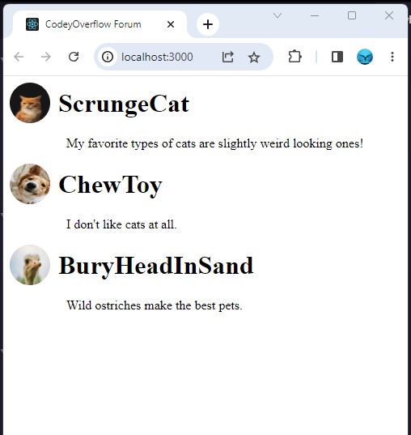

<h1 align="center">
    <a href="#"> React APP CodeyOverflow Forum </a>
</h1>

<h3 align="center">
    Simple project from CodeAcademy course with React.js! 
</h3>

<h4 align="center"> 
	 I build the beginnings of a web forum!
</h4>


## Layout




## Running the web application

```bash

# In the project directory, you can run:

> npm install
> npm start

```

---


## Author

Made by Serjus 👋🏽 
CodeAcademy Project!
## License

This project is under the license [MIT](./LICENSE).

---
